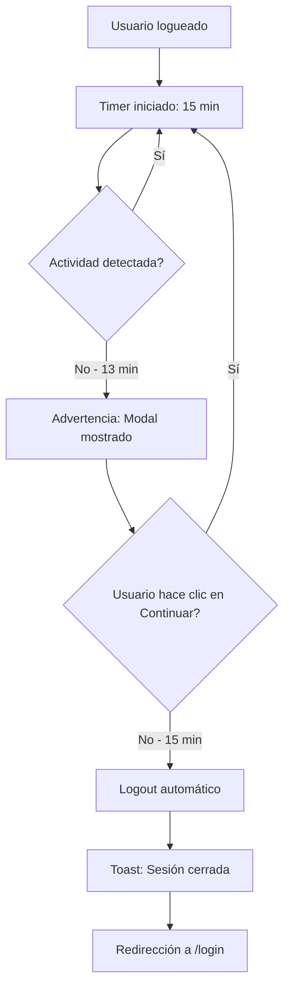

# Documentación: Cierre Automático de Sesión por Inactividad

## Descripción General

Se ha implementado un sistema de cierre automático de sesión que detecta la inactividad del usuario y cierra la sesión después de 15 minutos sin actividad. Esto ayuda a:
- **Ahorrar recursos de la base de datos** cerrando conexiones inactivas
- **Mejorar la seguridad** previniendo acceso no autorizado en sesiones abandonadas
- **Optimizar el rendimiento** liberando recursos del servidor

## Configuración Actual

| Parámetro | Valor | Descripción |
|-----------|-------|-------------|
| **Timeout** | 15 minutos | Tiempo de inactividad antes del logout |
| **Advertencia** | 2 minutos antes | Tiempo de aviso previo al cierre |
| **Eventos detectados** | mouse, teclado, scroll, touch | Actividades que resetean el timer |

## Archivos Implementados

### 1. `src/hooks/useIdleTimeout.ts`
Hook personalizado de React que:
- Monitorea eventos de actividad del usuario (mouse, teclado, scroll, touch)
- Implementa throttling para optimizar rendimiento (1 evento por segundo máximo)
- Gestiona timers para advertencia y logout automático
- Proporciona cuenta regresiva en tiempo real
- Es configurable y reutilizable

**Exports:**
```typescript
const {
  showWarning,     // boolean: mostrar advertencia
  remainingTime,   // number: segundos restantes
  resetTimer       // function: reiniciar timer manualmente
} = useIdleTimeout({
  timeout,
  warningTime,
  onTimeout,
  enabled
});
```

### 2. `src/components/IdleWarningModal.tsx`
Componente modal que:
- Se muestra 2 minutos antes del cierre automático
- Muestra cuenta regresiva en formato MM:SS
- Permite al usuario continuar la sesión con un botón
- Usa los colores corporativos de Mat89 (#91268F)
- UI responsiva y accesible

**Props:**
```typescript
interface IdleWarningModalProps {
  open: boolean;           // controla visibilidad
  remainingTime: number;   // segundos restantes
  onContinue: () => void;  // callback para continuar
}
```

### 3. `src/App.tsx` (Modificado)
Integración en el componente principal:
- Hook `useIdleTimeout` solo se activa cuando hay sesión activa
- Función `handleIdleTimeout` maneja el logout y notificación
- Modal de advertencia integrado en el árbol de componentes
- Toast informativo al cerrar sesión por inactividad

## Flujo de Funcionamiento



## Eventos Monitoreados

El sistema detecta las siguientes actividades del usuario:
- `mousedown` - Click del mouse
- `mousemove` - Movimiento del mouse
- `keypress` - Teclas presionadas
- `scroll` - Scroll en la página
- `touchstart` - Touch en dispositivos móviles
- `click` - Clicks en general

**Nota:** Se usa throttling para evitar exceso de procesamiento. Solo se procesa 1 evento por segundo.

## Personalización

Para modificar los tiempos, editar en [App.tsx:87-90](src/App.tsx#L87-L90):

```typescript
const { showWarning, remainingTime, resetTimer } = useIdleTimeout({
  timeout: 15 * 60 * 1000,      // Cambiar 15 por el número de minutos deseado
  warningTime: 2 * 60 * 1000,   // Cambiar 2 por el número de minutos antes
  onTimeout: handleIdleTimeout,
  enabled: !!session,
});
```

Para modificar los eventos monitoreados, editar en [useIdleTimeout.ts:23](src/hooks/useIdleTimeout.ts#L23):

```typescript
events?: string[];  // Array de eventos del DOM
```

## Pruebas

### Prueba Manual
1. Iniciar sesión en la aplicación
2. No interactuar con la aplicación durante 13 minutos
3. Verificar que aparece el modal de advertencia
4. Observar la cuenta regresiva (2 minutos)
5. **Opción A:** Hacer clic en "Continuar sesión" → Timer se resetea
6. **Opción B:** No hacer nada → Sesión se cierra automáticamente

### Prueba Rápida (Desarrollo)
Para probar más rápido, cambiar temporalmente:
```typescript
timeout: 30 * 1000,        // 30 segundos
warningTime: 10 * 1000,    // 10 segundos antes
```

## Comportamiento en Diferentes Escenarios

| Escenario | Comportamiento |
|-----------|----------------|
| Usuario activo | Timer se resetea continuamente |
| Usuario inactivo < 13 min | Nada sucede |
| Usuario inactivo = 13 min | Aparece modal de advertencia |
| Usuario hace clic en "Continuar" | Timer se resetea, modal se cierra |
| Usuario inactivo = 15 min | Logout automático + toast + redirección |
| Usuario no logueado | Hook deshabilitado (no consume recursos) |
| Usuario en login/reset-password | Hook no activo |

## Compatibilidad

- ✅ Navegadores modernos (Chrome, Firefox, Safari, Edge)
- ✅ Dispositivos móviles (iOS, Android)
- ✅ Tablets
- ✅ Compatible con sistema de autenticación Supabase existente
- ✅ No interfiere con otras funcionalidades de la aplicación

## Rendimiento

- **Throttling**: Solo 1 evento procesado por segundo
- **Event listeners pasivos**: No bloquean el scroll
- **Cleanup automático**: Todos los timers se limpian correctamente
- **Condicional**: Solo activo cuando hay sesión (ahorro de recursos)

## Seguridad

- Cierra sesiones abandonadas automáticamente
- Previene acceso no autorizado a sesiones olvidadas
- Advierte al usuario antes del cierre (no es sorpresivo)
- Limpia tokens y datos de Supabase al hacer logout

## Futuras Mejoras Posibles

1. **Configuración por rol**: Diferentes timeouts según rol del usuario
2. **Persistencia**: Recordar tiempo restante en localStorage
3. **Notificaciones del navegador**: Alerta del sistema operativo
4. **Estadísticas**: Tracking de sesiones cerradas por inactividad
5. **Modo "No molestar"**: Opción para deshabilitar temporalmente

## Soporte

Para reportar problemas o sugerencias relacionadas con esta funcionalidad:
1. Verificar logs en consola del navegador
2. Revisar estado de la sesión en Supabase
3. Comprobar que los event listeners estén activos
4. Validar que no haya errores de red o autenticación

## Notas Técnicas de Implementación

### Desafíos Resueltos

Durante la implementación se resolvieron varios desafíos técnicos importantes:

1. **Problema del modal que desaparecía inmediatamente:**
   - **Causa:** El cambio de estado `showWarning` causaba re-renders que ejecutaban el `useEffect`, llamando a `resetTimer()` que ponía `showWarning` en `false`.
   - **Solución:** Implementar un parámetro `forceReset` en `resetTimer()` para distinguir entre resets automáticos y manuales.

2. **Cronómetro que no hacía cuenta regresiva:**
   - **Causa:** El `useEffect` limpiaba todos los timers (incluyendo el interval del countdown) en cada re-render.
   - **Solución:** Usar `isWarningShownRef.current` para evitar limpiar el countdown cuando el warning está visible.

3. **Event listeners causando múltiples re-renders:**
   - **Causa:** Las dependencias del `useEffect` incluían funciones que cambiaban en cada render.
   - **Solución:** Usar refs (`isWarningShownRef`) en lugar de estado para evitar dependencias circulares.

### Arquitectura de la Solución

- **Hook personalizado (`useIdleTimeout`):** Encapsula toda la lógica de detección de inactividad
- **Ref-based state management:** Usa refs para estado que no necesita causar re-renders
- **Throttling:** Optimiza el rendimiento procesando máximo 1 evento por segundo
- **Cleanup condicional:** Solo limpia timers cuando es seguro hacerlo
- **Force reset pattern:** Distingue entre resets automáticos y manuales del usuario

---

**Fecha de implementación:** Octubre 2025
**Versión:** 1.0.0
**Estado:** ✅ Implementado, probado y funcionando correctamente
